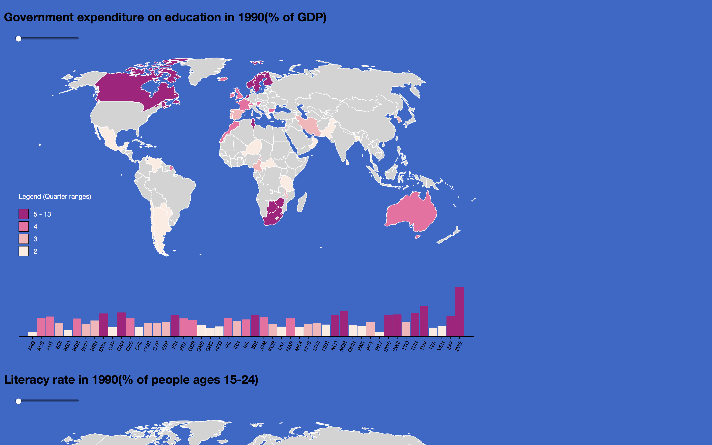
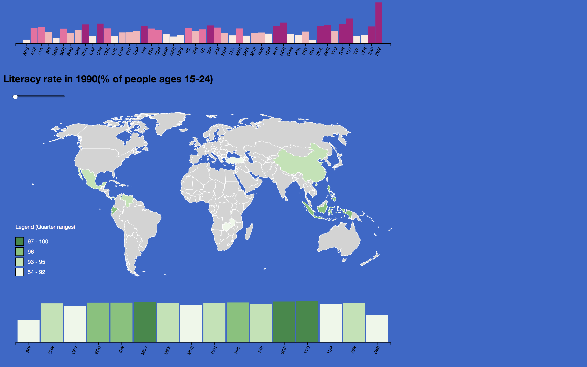

# Data Visualization 

2018 course project 

## Title
Exploring the relationship between National Education Expenditure and Youth Literacy Rate

## Objective of the project
#### a brief context of the project, and what tasks you're aiming to solve using visualizations, domain(target user) and task abstraction.
This visualization project serves mainly as an educational tool. The primary function of this project is to demonstrate how the government expenditure on education (% of GDP) and the Youth (15 - 24) Literacy rate of every country in the world change over time, from 1990 to 2017. Readers can make comparison among different countries as well as comparing how was the perfornamce one particular country in terms of the aformensioned two indicators in different years. 
It can be used in several contexts described below: 
* Helping World Bank to improve the user-friendliness of its data hub website by adding interactive visualization so that visitors can dig more insightful information ot of the datasets;
* Providing visualization tools for scholars in thier research on the effects of education on iliteracy on a global scale;
* Assisting economic or sociology lecturers in Universities to show students how educational expenditure and literacy rate change over time, and to inspire students to explore the possible interactions between these two factors. 
The target users are scholars, students, policy makers in international organizations, and general users of World Bank datasets, etc.

## Overview

__Team Member__

 Fangshu Lin[(fangshulin)](https://github.com/fangshulin)

Hongkai He[(davidhhk1994)](https://github.com/davidhhk1994)

 Yixuan Tang[(yixuantang)](https://github.com/yixuantang)

## Visualization description
This visualization project consists of two choropleth maps. The top map depicts how much each country in the world spent (% of GDP)on education in a particular year. The bottom map tells reader the how many people between 15 and 24 in each country in the world can read and write. 
We used Flask frame for the front-end and back-end. 
interaction: 
* Each map has a corresponding slider bar. By dragging the slider bars from left to right, a reader can see the change of the two factors over time from 1990 to 2017 by observing the change in color luminance (or value) in each country. 
* The reader can also compare the two factors in the same year by abchoring the two slider bars at the same position. 
* In addition, below each map there is a bar chart changing synchronically with the map. The bar chart shows the absolute education expenditure or literacy rate value of each country with the height and the color luminance of a signle bar represent the value of the corresponding country. It is worth noticing that number of bars also changes depending on how many countries have or do not have data in a given year. For example, if in a year there are 54 countries have actual data entries and the other countries does not have, there will be only 54 bars displayed in the bar chart. The x ticks of the bar charts are three-letter country name abbreviations. 
* A reader can also obtain the specific value of a target country by moving his/her cursor onto that country. The value and the country code will pop out and will remain its appearance until the cursor moves away. If there's no value of that country in that year, onlt the country code will display, followed by NA.
* Another interaction is that if the reader moves his/her cursor onto one category in the legend, the map will only display the countries that fall in this category in color. Countries in all other categories will be in light grey.

representation: 
* We use blue as our background color because first of all it represent water which conforms to the geographical common sense that continents are surrounded by ocean. Secondly it provides excellent chrominance contrast against the color we use to fill each country. 
* Another chrominance contrast we use is that the hue of the upper map is different from that of the lower map. By doing so the maps tell readers that they represent two different indicators. 
* We use a single color hue for each map but different luminance to represent different values of different countries because human readers have higher contrast sensitivity in luminance than in chrominance channel.
* For the two bar charts, the marks are rectangles and the channel we use is the vertical lengths as well as the color luminance of the rectangles. 

## Datasets

All the datasets are obtained from World Bank data hub. The name and link of each dataset are listed as follows:

[Government expenditure on education, total (% of GDP)](https://data.worldbank.org/indicator/SE.XPD.TOTL.GD.ZS?view=chart)

[Literacy rate, youth female (% of females ages 15-24)](https://data.worldbank.org/indicator/SE.ADT.1524.LT.FE.ZS)

The datasets have a time span from 1960 to now. However we only select data after 1990 because there is great absence of observations before 1990 in both datasets and this will lead to poor visualization effects. 
Both datasets have been pre-processed and converted from csv file to json file before they are inserted in the visualization. The links to the json dataset are listed below:

[education expenditure](https://raw.githubusercontent.com/yixuantang/DataVisualization2018/master/Dataset/education_expend.json)

[literacy rate](https://raw.githubusercontent.com/yixuantang/DataVisualization2018/master/Dataset/literacy.json)

In addition a json file that contains the geographical coordinates and geometries of all countries' boundaries is used to draw the map.

[Countries in the World](https://raw.githubusercontent.com/yixuantang/DataVisualization2018/master/Dataset/world.json)

## Outcome and Evaluation
This informative visualization project generally accomplishes it goal of providing an ituitive way for people to better understand the trends and patterns in the two datasets. However, one important "force majeure" that compromises this project's capability of providing a complete picture for each individual country is the lack of data. There are many countries which do not have data entries in all years hecne they remain in grey all the time and provide no insights. Other countries also suffer from intermittent absence of entries in several years. The visualization project will be more completed if the World Bank can fill in those blancks or more complete datasets from another authority can be found. 

## Link to the Visualization
* Check our Website [here](http://vis2018g16.pythonanywhere.com) !

## Possible Future Work
* Add a new interaction feature that can allow a reader to manually type in a country name to select that country. This feature will help people who may have a poor geographic knowledge of where the country is to quickly and accurately locate target country.
* Since the literacy dataset only contains relatively few records for each country during the period from 1990 to 2016, there are some blank areas in the map when selecting some year, we will try to incorperate more detailed dataset so that those blank area can be filled.
* Generalize this visualization project to other datasets hosted by World Bank. It will be tedious to make a new map for each dataset since there are hundreds of them. A better solution is to create another interactive feature that allows readers to choose which dataset he/she want to explore. 

